# Apex Cyber Sentinel — Autonomous Cyber Defense Platform

> **Adversarial co-evolution · Attack path mapping · Zero-day detection · Machine-speed response · Deception grid · CTI fusion · CSPM · ITDR**

Apex Cyber Sentinel is a modular, open-source autonomous cyber defense platform that combines adversarial co-evolution, behavioral analytics, graph-based attack path mapping, and machine-speed incident response into a unified defense pipeline. Built with a red/blue team loop at its core, it continuously learns, adapts, and hardens defenses against evolving threats — including zero-days.

---

## Table of Contents

- [Architecture Overview](#architecture-overview)
- [Adversarial Co-Evolution Loop](#adversarial-co-evolution-loop)
- [Attack Path Mapping](#attack-path-mapping)
- [Threat Hunting Pipeline](#threat-hunting-pipeline)
- [Machine-Speed Response](#machine-speed-response)
- [Deception Grid](#deception-grid)
- [CTI Fusion](#cti-fusion)
- [CSPM — Cloud Security Posture Management](#cspm--cloud-security-posture-management)
- [ITDR — Identity Threat Detection & Response](#itdr--identity-threat-detection--response)
- [Benchmark Comparisons](#benchmark-comparisons)
- [Installation & Usage](#installation--usage)
- [Testing](#testing)
- [Project Structure](#project-structure)
- [License](#license)

---

## Architecture Overview

Apex Cyber Sentinel is built around a **defense-in-depth** philosophy with nine integrated modules. Each module operates autonomously but feeds into a central defense pipeline that correlates, responds, and evolves.

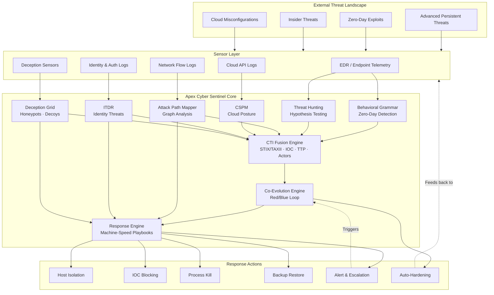

### Defense-in-Depth Architecture

```mermaid
flowchart LR
    subgraph Layer1["Layer 1: Perimeter"]
        FW[Firewall]
        WAF[WAF]
        DDoS[DDoS Protection]
    end

    subgraph Layer2["Layer 2: Network"]
        IDS[IDS/IPS]
        NTA[Network Traffic Analysis]
        SEG[Micro-Segmentation]
    end

    subgraph Layer3["Layer 3: Endpoint"]
        EDR[EDR]
        AV[Anti-Virus]
        HIPS[Host IPS]
    end

    subgraph Layer4["Layer 4: Application"]
        RASP[RASP]
        API_SEC[API Security]
        SAST[SAST/DAST]
    end

    subgraph Layer5["Layer 5: Data"]
        DLP[DLP]
        ENC[Encryption]
        IAM[IAM]
    end

    subgraph Layer6["Layer 6: Identity"]
        MFA[MFA]
        PAM[PAM]
        SSO[SSO]
    end

    Layer1 --> Layer2
    Layer2 --> Layer3
    Layer3 --> Layer4
    Layer4 --> Layer5
    Layer5 --> Layer6

    style Layer1 fill:#ffebee,stroke:#c62828
    style Layer2 fill:#fff3e0,stroke:#e65100
    style Layer3 fill:#e3f2fd,stroke:#1565c0
    style Layer4 fill:#f3e5f5,stroke:#6a1b9a
    style Layer5 fill:#e8f5e9,stroke:#2e7d32
    style Layer6 fill:#fce4ec,stroke:#ad1457
```

---

## Adversarial Co-Evolution Loop

The heart of Apex Cyber Sentinel is its **adversarial co-evolution engine** — a continuous red/blue team loop that simulates attacks, evaluates defenses, and automatically hardens the security posture. Each iteration produces measurable improvements in defense coverage and reductions in attack success rates.

```mermaid
flowchart LR
    subgraph Red["🔴 Red Team"]
        ATK_CAT[Attack Categories<br/>Injection · Exploit · Social<br/>Availability · Persistence]
        ATK_TECH[Attack Techniques<br/>SQLi · XSS · RCE<br/>Phishing · DDoS · Zero-Day]
        ATK_SIM[Attack Simulation<br/>Probabilistic Outcomes<br/>Seed-Controlled RNG]
    end

    subgraph Blue["🔵 Blue Team"]
        DEF_CTRL[Defense Controls<br/>WAF · IDS · Firewall<br/>Endpoint · Network · Patching]
        DEF_HARD[Defense Hardening<br/>Auto-Defense Generation<br/>Effectiveness Strengthening]
        DEF_METRICS[Defense Metrics<br/>Coverage · Success Rate<br/>Attack/Defense History]
    end

    subgraph Purple["🟣 Purple Team"]
        CO_ENG[Co-Evolution Engine<br/>Iteration Controller]
        LANDSCAPE[Threat Landscape<br/>State Tracker]
        REPORT[Purple Team Report<br/>Gaps · Recommendations]
    end

    ATK_CAT --> ATK_TECH
    ATK_TECH --> ATK_SIM
    ATK_SIM -->|Simulate Against| DEF_CTRL
    DEF_CTRL -->|Outcome| DEF_HARD
    DEF_HARD -->|New/Improved Controls| DEF_CTRL
    DEF_HARD --> DEF_METRICS
    DEF_METRICS --> CO_ENG
    CO_ENG --> LANDSCAPE
    LANDSCAPE -->|Next Iteration| ATK_SIM
    CO_ENG --> REPORT
    REPORT -->|Gap Analysis| DEF_HARD

    style Red fill:#ffebee,stroke:#c62828
    style Blue fill:#e3f2fd,stroke:#1565c0
    style Purple fill:#f3e5f5,stroke:#6a1b9a
```

### Co-Evolution Cycle Detail

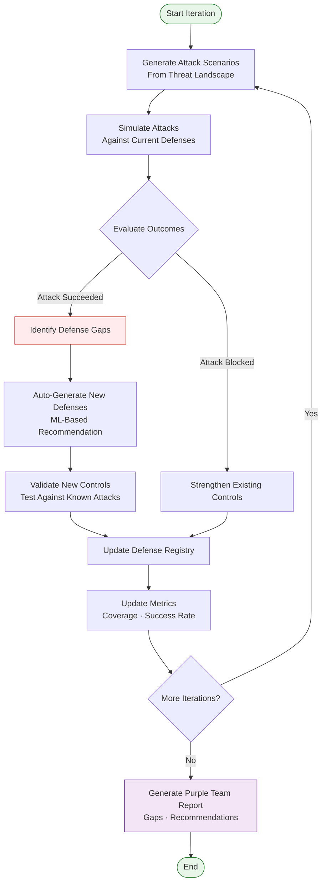

### Co-Evolution Metrics

| Metric | Description |
|--------|-------------|
| **Iterations** | Number of red/blue cycles completed |
| **Attack Count** | Unique attack techniques in the arsenal |
| **Defense Count** | Active defensive controls |
| **Success Rate** | Current attack success rate (decreases over time) |
| **Coverage** | Ratio of attack categories with matching defenses |

---

## Attack Path Mapping

Graph-based attack path mapping models the network as a directed graph and identifies all possible routes an attacker could take to reach critical assets. Uses Brandes' algorithm for betweenness centrality, BFS for shortest paths, and DFS for articulation point detection.

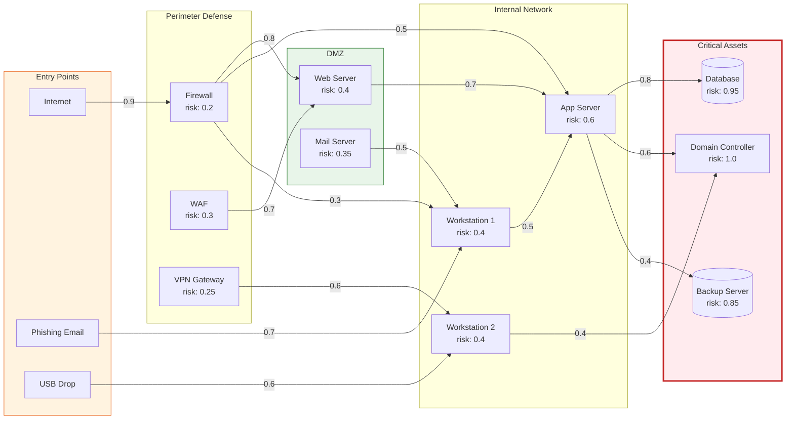

### Path Analysis Pipeline

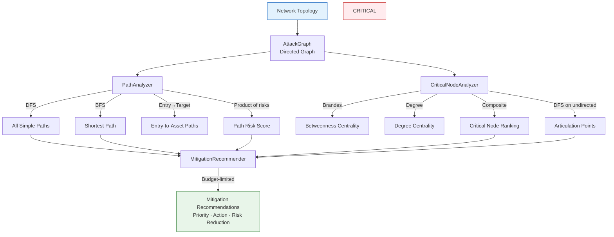

---

## Threat Hunting Pipeline

Autonomous threat hunting with hypothesis-driven investigation. The system creates hypotheses from IOCs and TTPs, tests them against event streams, and produces confirmed findings with confidence scores.

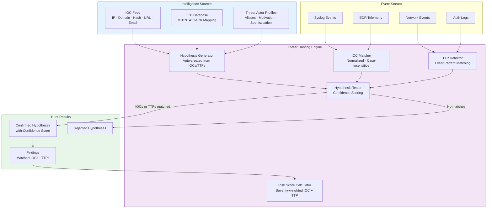

### Risk Scoring Model

| Factor | Weight | Description |
|--------|--------|-------------|
| Critical IOC | 1.0 | Known-bad indicator match |
| High IOC | 0.6 | Suspicious indicator match |
| Medium IOC | 0.3 | Potentially malicious |
| Low IOC | 0.1 | Informational |
| Per TTP | 0.2 | Each matched technique adds to score |
| **Cap** | 1.0 | Score normalized to [0, 1] |

---

## Machine-Speed Response

Incident response engine that executes containment, eradication, and recovery playbooks under a hard wall-clock budget (default 5 seconds, sub-10s guaranteed). Actions within each phase run in parallel with per-action timeouts.

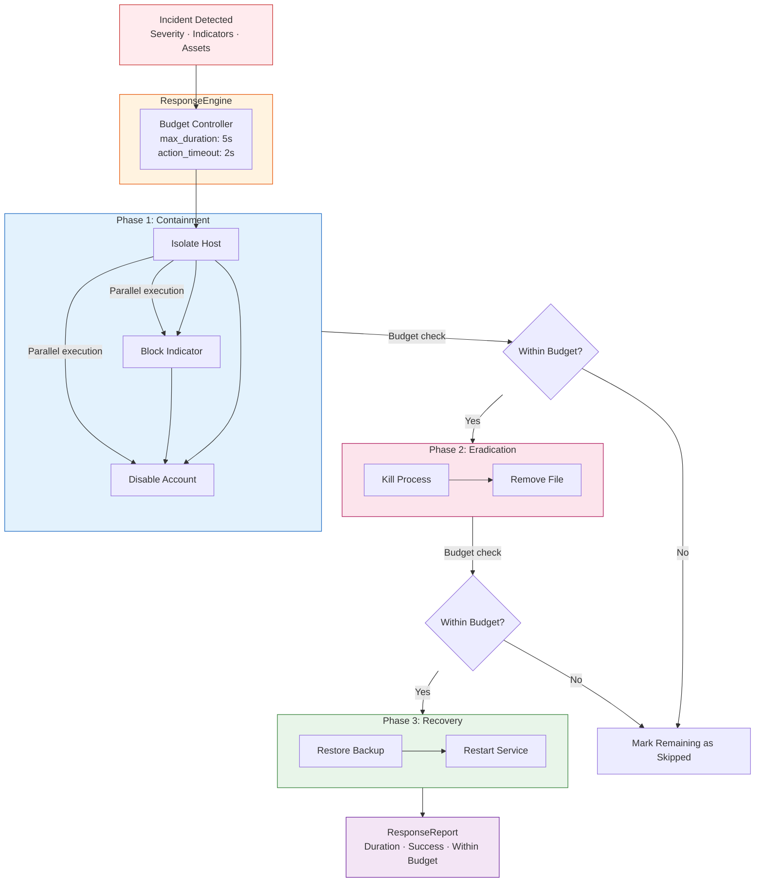

### Response Guarantees

| Guarantee | Value |
|-----------|-------|
| Default max duration | 5.0 seconds |
| Action timeout | 2.0 seconds |
| Parallelism | All actions within a phase run concurrently |
| Budget enforcement | Hard wall-clock limit; remaining actions skipped |
| Exception handling | Captured per-action; does not abort playbook |
| Determinism | Budget check before each phase transition |

---

## Deception Grid

A distributed deception layer comprising honeypots, decoys, and attacker engagement tracking. The grid detects lateral movement, collects attacker intelligence, and feeds IOCs back into the CTI fusion engine.

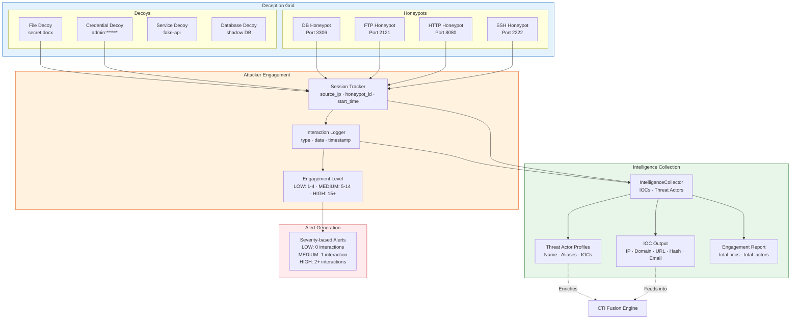

---

## CTI Fusion

Cyber Threat Intelligence module providing IOC ingestion (JSON/CSV/text with auto-detection), TTP mapping to MITRE ATT&CK, threat actor tracking, and intelligence sharing via STIX 2.1 and TAXII 2.1 standards with TLP enforcement.

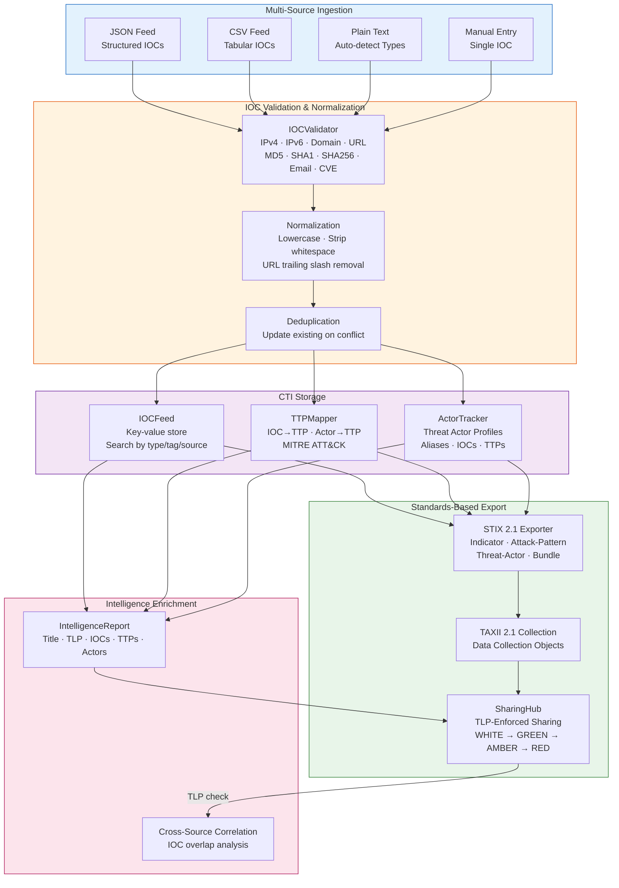

### TLP Sharing Rules

| TLP Level | Can Share With |
|-----------|---------------|
| **WHITE** | Anyone (public) |
| **GREEN** | Community members |
| **AMBER** | Organization members only |
| **RED** | Named recipients only |

---

## CSPM — Cloud Security Posture Management

Cloud configuration assessment, compliance checking, and remediation for AWS resources. Evaluates S3 buckets, security groups, and IAM policies against CIS, NIST, PCI-DSS, and HIPAA frameworks.

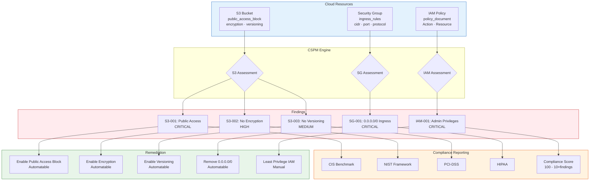

---

## ITDR — Identity Threat Detection & Response

Detects identity anomalies, credential compromise, and lateral movement from authentication logs and network connection data. Covers impossible travel, brute force, password spraying, credential stuffing, pass-the-hash, and service account abuse.

```mermaid
flowchart TD
    subgraph Input["Identity Data Sources"]
        LOGIN[Login Events<br/>user · source_ip · location<br/>success · auth_method]
        CONN[Network Connections<br/>source_host · dest_host<br/>user · protocol]
        BREACH[Breached Credential Set]
        HIST[Historical Login Data]
    end

    subgraph Detection["ITDR Detection Engines"]
        direction TB
        subgraph IdentityAnomaly["Identity Anomaly Detector"]
            IT[Impossible Travel<br/>Haversine distance<br/>speed > 900 km/h]
            OFF[Off-Hours Access<br/>Outside 9-17]
            NEWLOC[New Location<br/>Min distance from history]
            CONC[Concurrent Sessions<br/>Same user, different IPs<br/>within 30 min]
        end

        subgraph CredComp["Credential Compromise Detector"]
            BF[Brute Force<br/>5+ failures in 10 min]
            PS[Password Spraying<br/>1 IP → 3+ accounts]
            CS[Credential Stuffing<br/>Known breached creds]
            SAF[Success After Failures<br/>Success after 2+ failures]
        end

        subgraph LatMove["Lateral Movement Detector"]
            SEQ[Sequential Host Access<br/>3+ hosts in 60 min]
            PTH[Pass-the-Hash<br/>NTLM without interactive login]
            ADM[New Admin Connection<br/>Admin → unseen host]
            SAA[Service Account Abuse<br/>Service acct → 3+ hosts]
        end
    end

    subgraph Output["ITDR Report"]
        ALERTS[Aggregated Alerts<br/>type · severity · user · details]
        SUMMARY[Summary by Type<br/>by Severity]
    end

    LOGIN --> IT
    LOGIN --> OFF
    LOGIN --> CONC
    HIST --> NEWLOC
    LOGIN --> BF
    LOGIN --> PS
    BREACH --> CS
    LOGIN --> SAF
    CONN --> SEQ
    CONN --> PTH
    CONN --> ADM
    CONN --> SAA

    IT --> ALERTS
    OFF --> ALERTS
    NEWLOC --> ALERTS
    CONC --> ALERTS
    BF --> ALERTS
    PS --> ALERTS
    CS --> ALERTS
    SAF --> ALERTS
    SEQ --> ALERTS
    PTH --> ALERTS
    ADM --> ALERTS
    SAA --> ALERTS

    ALERTS --> SUMMARY

    style Input fill:#e3f2fd,stroke:#1565c0
    style IdentityAnomaly fill:#fff3e0,stroke:#e65100
    style CredComp fill:#fce4ec,stroke:#ad1457
    style LatMove fill:#f3e5f5,stroke:#6a1b9a
    style Output fill:#e8f5e9,stroke:#2e7d32
```

### ITDR Alert Types

| Alert Type | Severity | Trigger |
|------------|----------|---------|
| Impossible Travel | HIGH | Speed > 900 km/h between logins |
| Off-Hours Access | MEDIUM | Login outside configured work hours |
| New Location | MEDIUM | Login far from all historical locations |
| Concurrent Sessions | HIGH | Same user, different IPs in 30 min |
| Brute Force | HIGH | 5+ failed logins in 10 min |
| Password Spraying | HIGH | 1 IP targeting 3+ accounts |
| Credential Stuffing | CRITICAL | Login with known breached credentials |
| Success After Failures | CRITICAL | Success after 2+ consecutive failures |
| Lateral Movement | HIGH | 3+ distinct hosts accessed in 60 min |
| Pass-the-Hash | CRITICAL | NTLM auth without interactive login |
| New Admin Connection | MEDIUM | Admin connecting to unseen host |
| Service Account Abuse | HIGH | Service account accessing 3+ hosts |

---

## Benchmark Comparisons

### Feature Matrix

| Capability | Apex Cyber Sentinel | CrowdStrike Falcon | SentinelOne Singularity | Palo Alto Cortex | Darktrace |
|------------|:---:|:---:|:---:|:---:|:---:|
| **Endpoint Detection & Response** | ✅ | ✅ | ✅ | ✅ | ✅ |
| **Behavioral Zero-Day Detection** | ✅ | ✅ | ✅ | ✅ | ✅ |
| **Adversarial Co-Evolution** | ✅ | ❌ | ❌ | ❌ | ❌ |
| **Attack Path Mapping (Graph)** | ✅ | ⚠️ Limited | ❌ | ⚠️ Limited | ❌ |
| **Machine-Speed Response (<10s)** | ✅ | ✅ | ✅ | ✅ | ⚠️ |
| **Deception Grid (Honeypots)** | ✅ | ✅ | ❌ | ❌ | ✅ |
| **CTI Fusion (STIX/TAXII)** | ✅ | ✅ | ✅ | ✅ | ⚠️ |
| **CSPM (Cloud Posture)** | ✅ | ⚠️ | ⚠️ | ✅ | ❌ |
| **ITDR (Identity Threats)** | ✅ | ✅ | ✅ | ✅ | ✅ |
| **Autonomous Threat Hunting** | ✅ | ✅ | ✅ | ✅ | ✅ |
| **Purple Team Validation** | ✅ | ❌ | ❌ | ❌ | ❌ |
| **Open Source** | ✅ AGPL-3.0 | ❌ Proprietary | ❌ Proprietary | ❌ Proprietary | ❌ Proprietary |
| **Self-Hosted / On-Prem** | ✅ | ⚠️ Cloud-only | ⚠️ Cloud-only | ⚠️ Cloud-only | ⚠️ Appliance |

> ✅ Full support · ⚠️ Partial/Limited · ❌ Not available

### Detection Capability Comparison

| Detection Method | Apex Cyber Sentinel | CrowdStrike | SentinelOne | Palo Alto Cortex | Darktrace |
|------------------|:---:|:---:|:---:|:---:|:---:|
| Signature-Based | ✅ | ✅ | ✅ | ✅ | ✅ |
| Behavioral Analytics | ✅ | ✅ | ✅ | ✅ | ✅ |
| N-Gram Pattern Learning | ✅ | ❌ | ❌ | ❌ | ❌ |
| Graph-Based Path Analysis | ✅ | ❌ | ❌ | ❌ | ❌ |
| Identity Anomaly (Impossible Travel) | ✅ | ✅ | ✅ | ✅ | ✅ |
| Credential Compromise | ✅ | ✅ | ✅ | ✅ | ⚠️ |
| Lateral Movement | ✅ | ✅ | ✅ | ✅ | ✅ |
| Deception-Based Detection | ✅ | ✅ | ❌ | ❌ | ✅ |

### Response Automation Comparison

| Response Capability | Apex Cyber Sentinel | CrowdStrike | SentinelOne | Palo Alto Cortex | Darktrace |
|---------------------|:---:|:---:|:---:|:---:|:---:|
| Host Isolation | ✅ | ✅ | ✅ | ✅ | ✅ |
| IOC Blocking | ✅ | ✅ | ✅ | ✅ | ✅ |
| Process Termination | ✅ | ✅ | ✅ | ✅ | ✅ |
| Account Disable | ✅ | ✅ | ✅ | ✅ | ✅ |
| Backup Restore | ✅ | ⚠️ | ⚠️ | ❌ | ❌ |
| Auto-Hardening | ✅ | ❌ | ❌ | ❌ | ❌ |
| Parallel Action Execution | ✅ | ✅ | ✅ | ✅ | ⚠️ |
| Hard Wall-Clock Budget | ✅ | ❌ | ❌ | ❌ | ❌ |
| Playbook Phases | ✅ | ✅ | ✅ | ✅ | ✅ |

### Architecture & Deployment Comparison

| Aspect | Apex Cyber Sentinel | CrowdStrike | SentinelOne | Palo Alto Cortex | Darktrace |
|--------|:---:|:---:|:---:|:---:|:---:|
| **Deployment** | Self-hosted / Cloud | Cloud SaaS | Cloud SaaS | Cloud SaaS | Appliance / Cloud |
| **Agent Required** | No (library) | Yes | Yes | Yes | Yes |
| **Modular Architecture** | ✅ | ❌ | ❌ | ❌ | ❌ |
| **Python Native** | ✅ | ❌ | ❌ | ❌ | ❌ |
| **Extensible API** | ✅ | ✅ | ✅ | ✅ | ⚠️ |
| **Open Standards (STIX/TAXII)** | ✅ | ✅ | ✅ | ✅ | ⚠️ |
| **Community-Driven** | ✅ | ❌ | ❌ | ❌ | ❌ |

### Apex Cyber Sentinel Unique Advantages

1. **Adversarial Co-Evolution**: The only platform with a built-in red/blue team loop that automatically hardens defenses through continuous simulation
2. **Graph-Based Attack Path Mapping**: Full attack graph analysis with betweenness centrality, articulation points, and mitigation recommendations
3. **N-Gram Behavioral Grammar**: Learns normal behavior patterns and detects zero-days through deviation analysis
4. **Hard-Budget Response**: Guaranteed sub-10-second response with parallel execution and per-action timeouts
5. **Integrated Deception Grid**: Honeypots, decoys, and attacker engagement tracking built into the core platform
6. **Full STIX/TAXII Support**: Standards-based intelligence sharing with TLP enforcement
7. **Open Source (AGPL-3.0)**: Fully auditable, extensible, and self-hostable

---

## Installation & Usage

### Prerequisites

- Python 3.10+
- pip

### Install

```bash
git clone https://github.com/your-org/Apex_Cyber_Sentinel.git
cd Apex_Cyber_Sentinel
pip install -e .
```

### Quick Start

```python
from src.cyber.coevolution import CoEvolutionEngine, AttackTechnique, DefenseControl

# Initialize the co-evolution engine
engine = CoEvolutionEngine(seed=42)

# Add attack techniques
engine.add_attack_technique(AttackTechnique(
    name="SQL Injection", category="injection", severity=0.8
))
engine.add_attack_technique(AttackTechnique(
    name="XSS", category="injection", severity=0.6
))

# Add initial defenses
engine.add_defense_control(DefenseControl(
    name="WAF", category="injection", effectiveness=0.7
))

# Run co-evolution iterations
engine.run_iterations(10)

# Check metrics
metrics = engine.get_metrics()
print(f"Coverage: {metrics['coverage']:.1%}")
print(f"Success Rate: {metrics['success_rate']:.1%}")
print(f"Defense Count: {metrics['defense_count']}")
```

### Attack Path Mapping

```python
from src.cyber.attack_graph import AttackGraph, PathAnalyzer, CriticalNodeAnalyzer

# Build attack graph
graph = AttackGraph()
graph.add_node("internet", node_type="entry", risk=0.1)
graph.add_node("firewall", node_type="firewall", risk=0.2)
graph.add_node("db", node_type="critical", risk=0.95)
graph.add_edge("internet", "firewall", probability=0.9)
graph.add_edge("firewall", "db", probability=0.7)

# Analyze paths
pa = PathAnalyzer(graph)
paths = pa.find_all_paths("internet", "db")
print(f"Attack paths: {paths}")

# Find critical nodes
cna = CriticalNodeAnalyzer(graph)
critical = cna.get_critical_nodes(top_n=3)
print(f"Critical nodes: {critical}")
```

### Machine-Speed Response

```python
from src.cyber.response import Incident, Indicator, ResponseEngine, ResponsePlaybook

# Create an incident
incident = Incident(
    id="INC-001",
    severity="critical",
    title="Ransomware detected",
    indicators=[Indicator(type="ip", value="203.0.113.10")],
    affected_assets=["fs-01"],
    detected_at=__import__('time').time(),
)

# Execute response playbook
engine = ResponseEngine(ResponsePlaybook.default(), max_duration=5.0)
report = engine.respond(incident)
print(f"Response completed in {report.duration:.2f}s")
print(f"Within budget: {report.within_budget}")
```

---

## Testing

The project uses **pytest** with comprehensive unit and integration tests.

```bash
# Run all tests
pytest

# Run with coverage
pytest --cov=src --cov-report=html

# Run specific module tests
pytest tests/test_coevolution.py -v
pytest tests/test_attack_graph.py -v
pytest tests/test_response.py -v

# Run integration tests
pytest tests/integration/ -v
```

### Test Coverage

| Module | Test File | Tests |
|--------|-----------|-------|
| Co-Evolution | `test_coevolution.py` | 30+ |
| Attack Graph | `test_attack_graph.py` | 40+ |
| Behavioral Grammar | `test_behavioral.py` | 25+ |
| Response Engine | `test_response.py` | 25+ |
| Deception Grid | `test_deception.py` | 30+ |
| CTI | `test_cti.py` | 50+ |
| CSPM | `test_cspm.py` | 20+ |
| ITDR | `test_itdr.py` | 15+ |
| Threat Hunting | `test_hunting.py` | 20+ |
| Integration | `test_cyber.py` | 12 E2E |

**Total: 669 tests across 29 files covering 10 topics**

---

## Project Structure

```
Apex_Cyber_Sentinel/
├── src/
│   └── cyber/
│       ├── __init__.py
│       ├── coevolution.py      # Adversarial co-evolution engine
│       ├── attack_graph.py     # Graph-based attack path mapping
│       ├── behavioral.py       # N-gram behavioral grammar
│       ├── response.py         # Machine-speed incident response
│       ├── deception.py        # Deception grid (honeypots, decoys)
│       ├── cti.py              # CTI fusion (STIX/TAXII)
│       ├── cspm.py             # Cloud Security Posture Management
│       ├── itdr.py             # Identity Threat Detection & Response
│       └── hunting.py          # Autonomous threat hunting
├── tests/
│   ├── test_coevolution.py
│   ├── test_attack_graph.py
│   ├── test_behavioral.py
│   ├── test_response.py
│   ├── test_deception.py
│   ├── test_cti.py
│   ├── test_cspm.py
│   ├── test_itdr.py
│   ├── test_hunting.py
│   └── integration/
│       └── test_cyber.py       # End-to-end pipeline tests
├── docs/
├── pytest.ini
├── README.md
└── LICENSE
```

---

## License

This project is licensed under the **GNU Affero General Public License v3.0 (AGPL-3.0)**.

```
Apex Cyber Sentinel — Autonomous Cyber Defense Platform
Copyright (C) 2024 Ahmed Hassan

This program is free software: you can redistribute it and/or modify
it under the terms of the GNU Affero General Public License as published
by the Free Software Foundation, either version 3 of the License, or
(at your option) any later version.

This program is distributed in the hope that it will be useful,
but WITHOUT ANY WARRANTY; without even the implied warranty of
MERCHANTABILITY or FITNESS FOR A PARTICULAR PURPOSE.  See the
GNU Affero General Public License for more details.

You should have received a copy of the GNU Affero General Public License
along with this program.  If not, see <https://www.gnu.org/licenses/>.
```

See [LICENSE](LICENSE) for the full license text.

---

<div align="center">

**Apex Cyber Sentinel** — *Autonomous defense through adversarial co-evolution.*

**669 tests · 29 files · 10 topics · AGPL-3.0**

</div>
